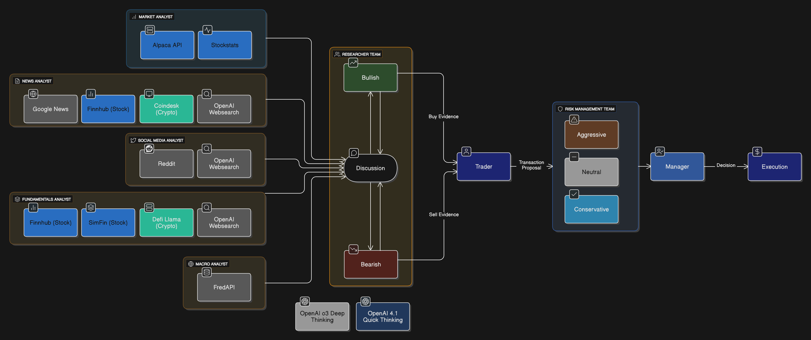
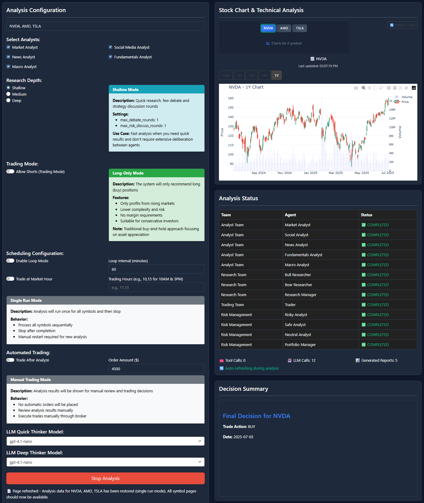
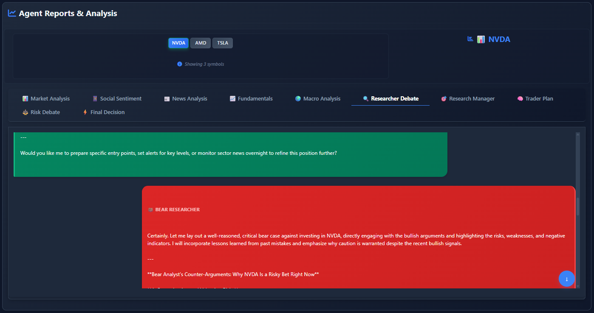

# Vivid Alpaca

**Vivid Alpaca** is a paper-first multi-agent AI trading lab built on the AlpacaTradingAgent / TradingAgents lineage. It explores how LLM-powered analyst, trader, and risk-manager agents can support financial decision-making while staying inside explicit paper-trading guardrails.

> This public repository is a showcase of the project concept, architecture, safety posture, and learning outcomes. The full runnable implementation, private session notes, trading playbooks, and build process are intentionally kept private.

## What It Demonstrates

- Multi-agent financial analysis across market, news, fundamentals, sentiment, macro, trader, and risk-manager roles.
- Alpaca paper-account integration for account, orders, positions, and paper execution workflows.
- Execution-layer risk guardrails that sit between agent recommendations and broker order submission.
- Configurable agent mindset, including balanced-growth, capital-preservation, and paper-only aggressive-training modes.
- Goal-aware workflows where the user can express a time-bound paper-trading objective while guardrails remain active.
- A learning loop for evaluating whether an AI trading agent is becoming consistently strong before any real-money consideration.

## Architecture Snapshot

<p align="center">
  
</p>

## UI Direction

The private working version includes a Dash-based interface for configuring symbols, research depth, agent risk profile, time-bound goals, and paper-trading behavior.

<p align="center">
  
</p>

The system surfaces agent reports and debate-style reasoning so trade decisions can be reviewed rather than treated as black-box signals.

<p align="center">
  
</p>

## Original vs Vivid Alpaca

| Area | Upstream Baseline | Vivid Alpaca Direction |
|---|---|---|
| Purpose | Multi-agent trading framework with Alpaca integration | Personalized paper-trading learning lab and AI trading portfolio project |
| Safety posture | Agent/risk-manager reasoning around trade decisions | Paper-first with explicit execution guardrails before broker submission |
| Agent behavior | Can lean conservative or produce frequent neutral outputs | Configurable mindset so `NEUTRAL` means genuinely weak or unclear setup |
| User goals | Mostly implicit through prompts/config | UI-driven goal overlay with target return, time horizon, and max drawdown |
| Learning loop | Run analysis and review outputs | Run, paper-trade, compare decisions to guardrails, document lessons, improve |
| Monetization boundary | Open framework | Public showcase only; full implementation and training workflow remain private |

## Safety Positioning

Vivid Alpaca is currently paper-first.

Live trading is not the current operating goal. Before real-money use, the private system still needs mandatory manual approval, a live-mode confirmation wall, structured stop-loss/take-profit handling, journaling, replay/backtesting of guardrails, and cooldown rules.

This project is not financial, investment, or trading advice.

## Upstream Attribution

Vivid Alpaca is derived from:

- [huygiatrng/AlpacaTradingAgent](https://github.com/huygiatrng/AlpacaTradingAgent)

That project builds on concepts from:

- [TauricResearch/TradingAgents](https://github.com/TauricResearch/TradingAgents)

The original TradingAgents paper/project should be cited as:

```bibtex
@misc{xiao2025tradingagentsmultiagentsllmfinancial,
      title={TradingAgents: Multi-Agents LLM Financial Trading Framework},
      author={Yijia Xiao and Edward Sun and Di Luo and Wei Wang},
      year={2025},
      eprint={2412.20138},
      archivePrefix={arXiv},
      primaryClass={q-fin.TR},
      url={https://arxiv.org/abs/2412.20138},
}
```

## License

This showcase preserves the upstream Apache-2.0 license. The public materials are provided for educational and portfolio demonstration purposes.
